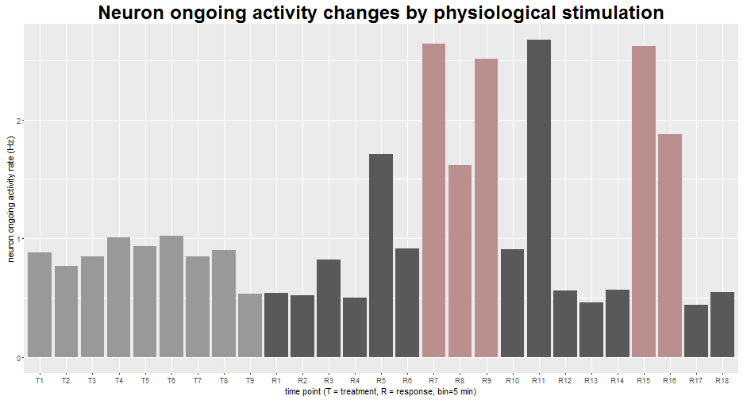

## Purpose of the calculator

This calculator is a small tool developed based on our research project of measuring the trigeminal neuron responses to CSD
stimulation. In each experiment neuron ongoing activity rate of 3 periods are saved in a txt file. The periods baseline (B), 
treatment (T), response (R) represent neuron's natual activity level, neuron's activity level after drug treatment, neuron's 
activity level after cortical spreading depression stimulation respectively. Each period has a series of time bins (bin=5min).
We use mean() function to measure B and T period neuron level, then compare R to T to check whether it is activated or not 
basing on 95% confidence interval. Only 2 continuous bins higher than standard is considered as activation.

--- .class #id 

## How to use the calculator

1. choose the experiment result txt file which wants to be calculated. 
2. set the "Standard measure method" that used to identify the activation bin.
3. fill information about the drug administration.
4. click the "Calculate" button to show the result.

--- .class #id 

## The code to identify activated time period


```r
actiTrial <- eventReactive(input$submit, {
                        if(is.null(recordData)){return()}
                        # actiTrial is the vector to record each bin either activated or not
                        tmp <- vector(mode = "character", length = 0)
                        a <- append(stimulate(),0)
                        a <- append(a,0,after=0)
                        for(i in 1:length(a)){
                                if(a[i] >standard() && (a[i-1]>standard() || a[i+1]>standard())){
                                        tmp[i] <- "Y"
                                }else{
                                        tmp[i] <- "N"
                                }
                        }
                        return(tmp[-c(1,length(tmp))])
                })
```


--- .class #id

## An example of the output plot




